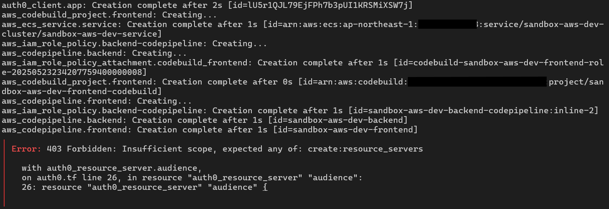

# 正誤表
## 1.2.10 IdP(Auth0)   Auth0のMachine to Machine Application作成

### 修正点
- 手順に***Auth0 Management API を選択*** が不足している
- アプリケーション作成時に指定するパーミッションが不足している

### 誤
- アプリケーション名は任意(ここでは、Terraform Provider Auth0 auth)
- permissionsは以下を選択
    - read:clients
    - update:clients
    - delete:clients
    - create:clients

### 正
- アプリケーション名は任意(ここでは、Terraform Provider Auth0 auth)
- ***Auth0 Management API を選択***
- permissionsは以下を選択
    - read:clients
    - update:clients
    - delete:clients
    - create:clients
    - ***read:resource_servers***
    - ***update:resource_servers***
    - ***delete:resource_servers***
    - ***create:resource_servers***

### 誤のままだとこうなります
terraform apply でエラーになります。
`create:resource_servers` のpermissionがないためです。


```
│ Error: 403 Forbidden: Insufficient scope, expected any of: create:resource_servers
│
│   with auth0_resource_server.audience,
│   on auth0.tf line 26, in resource "auth0_resource_server" "audience":
│   26: resource "auth0_resource_server" "audience" {
```
